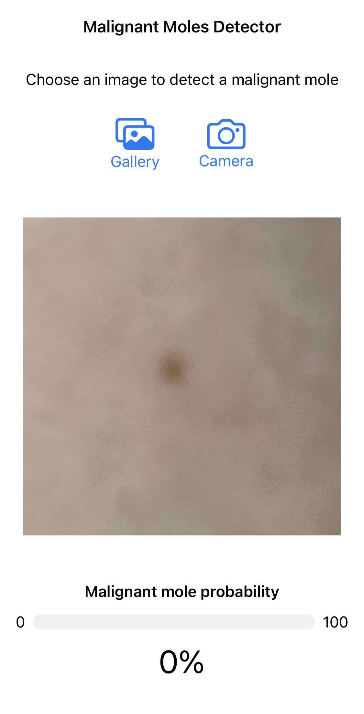

# Malignant moles detector

Simple iOS app to detect malignant moles in your skin using a convolutional neural network trained using transfer learning.

- Dataset: https://www.kaggle.com/datasets/fanconic/skin-cancer-malignant-vs-benign
- Neural network used to train the dataset using transfer learning: MobileNetV3
- This project makes use of PyTorch Mobile, example project: https://github.com/pytorch/ios-demo-app/tree/master/HelloWorld
- [ ] TODO: add disclaimer screen showing how to take pictures properly and showing some examples
- [ ] TODO: improve horizontal layout and layout in iPad

**Disclaimer:**

This app is designed to assist in the detection of malignant skin moles using AI technology. It is not a substitute for professional medical advice, diagnosis, or treatment. Always seek the advice of your physician or other qualified health provider with any questions you may have regarding a medical condition. Do not disregard professional medical advice or delay in seeking it because of something you have read on this app. Use this app at your own risk.
